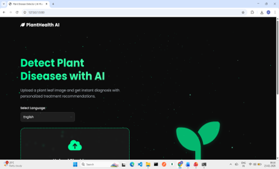
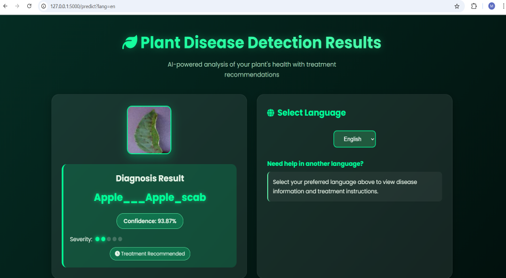
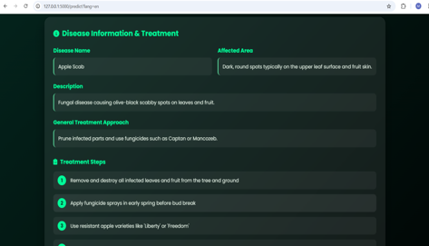
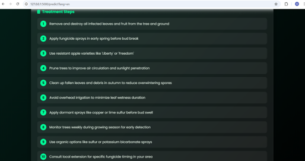

# 🌱 Plant Leaf Disease Prediction

A hybrid deep learning system for accurate plant leaf disease prediction using **ResNet50, Swin Transformer, and EfficientNet-B3** with decision-level fusion.

## 📌 Project Overview

Crop diseases can significantly affect agricultural productivity when they are not detected early.

This project proposes a hybrid deep learning approach to identify plant diseases from leaf images by combining multiple deep learning architectures. The system uses **ResNet50, Swin Transformer, and EfficientNet-B3** with decision-level fusion to improve prediction accuracy and robustness.

The project also integrates **Explainable AI (XAI)** techniques such as **SHAP and Grad-CAM** to make model predictions more transparent and understandable.

Additionally, the system provides **multilingual disease and remedy recommendations** in **English, Tamil, and Hindi** to improve accessibility for farmers.

## 🚀 Key Features

* 🌿 Plant leaf disease prediction from images
* 🧠 Hybrid deep learning using ResNet50, Swin Transformer and EfficientNet-B3
* 🔗 Decision-level fusion for improved prediction
* 🔍 Explainable AI using SHAP and Grad-CAM
* 🌐 Multilingual output: English, Tamil and Hindi
* 💊 Disease-specific remedy recommendations
* 📊 Model performance evaluation using the PlantVillage dataset

## 🛠️ Technologies Used

* Python
* Deep Learning
* ResNet50
* Swin Transformer
* EfficientNet-B3
* SHAP
* Grad-CAM
* Computer Vision
* PlantVillage Dataset

## 📂 Dataset

The **PlantVillage dataset** is used for training and evaluation.

> The dataset is not included in this repository because it contains a large number of image files.

## ▶️ How to Run

### 1. Clone the Repository

```bash
git clone https://github.com/Malini-1326/Plant-Leaf-Disease-Prediction.git
cd Plant-Leaf-Disease-Prediction
```

### 2. Create a Virtual Environment

```bash
python -m venv venv
```

### 3. Activate the Virtual Environment

**Windows:**

```bash
venv\Scripts\activate
```

### 4. Install Dependencies

```bash
pip install -r requirements.txt
```

### 5. Run the Application

```bash
python app.py
```

### 6. Open in Browser

Open the application in your browser:

```text
http://127.0.0.1:5000/
```


## 🎯 Objective

The main objective of this project is to develop an accurate and explainable plant disease prediction system that can assist farmers in identifying diseases early and accessing understandable disease-related recommendations.

## 🔮 Future Enhancements

* Mobile application integration
* Real-time camera-based disease detection
* Support for additional crops and diseases
* More regional languages
* Cloud deployment

## 🖼️ Project Screenshots

### 1. Project Interface


### 2. Disease Prediction


### 3. Prediction Result


### 4. Multilingual / Remedy Output


## 👩‍💻 Author

**Malini S**
